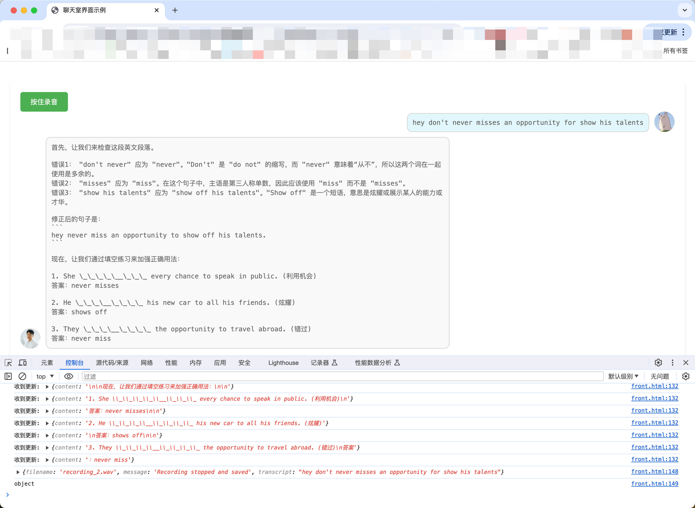

  

# GrammatriX

  

## 简介

  一个基于生成式大模型的人机英语口语对话网页，前端对话，后端音转文后调用大模型分析用户口语语法，并给出合理纠错建议。
  通过这个平台，用户可以进行英语口语练习，同时接受语法错误分析、个性化学习建议等多种辅助功能，帮助他们更有效地提高英语水平。

当前实现技术：
- 后端：python 的 Flask
- 前端：Vue
  


## 环境准备

  

确保你的机器上安装了conda和Python 3.9环境。
调用的第三方工具，需要自己账号获得配置信息。有免费额度，前期开发个人足够：
	1. 音转文：Google Speech-to-Text，参考配置文档
		1. 按官方步骤把.json文件放入本地并按路径配置，也可直接输入下列命令暂时用我的配置文件。
			1. mac的生效命令：`export GOOGLE_APPLICATION_CREDENTIALS="./resource/service-account-file.json"`
			2. win的生效命令，cmd中：`set GOOGLE_APPLICATION_CREDENTIALS=.\resource\service-account-file.json
		2. 也可使用星火的”音转文“，暂未尝试
`
	2. 大模型：讯飞星火大模型3.0，参考[配置文档](https://xinghuo.xfyun.cn/sparkapi#:~:text=%C2%A50-,%E5%85%8D%E8%B4%B9%E8%AF%95%E7%94%A8,-%E6%9C%8D%E5%8A%A1%E9%87%8F500)。先免费认领，然后把[你控制台](https://console.xfyun.cn/services/bm3)的以下信息粘贴过来。
		1. 需要按文档填写在截图中

  

## 安装步骤

  

1. 克隆项目到本地：

```

https://github.com/rollingfruit/GrammatriX.git

```

  

2. 进入项目目录：

```

cd GrammatriX

```

  

3. 创建一个名为`grammar`的conda环境，并激活它：

```

conda create --name grammar python=3.9

conda activate grammar

```

  

4. 安装项目依赖：

```
mac:
pip install -r ./resource/dependencies.txt


win:

pip install -r .\resource\dependencies.txt
```

  

注：`dependencies.txt`文件应包含所有必要的依赖包。此文件可以从项目根目录获取。

  

5. 启动服务：

```

python backen.py

```
得到后端启动成功页面
	

- 启动前端：
	- 进入static文件夹，双击打开`front.html`文件。
	- 按F12，若此时点击”开始录音“按钮不报错，则前后端联调成功。
		- 此处若CORS问题，可安装chrome插件”Allow CORS: Access-Control-Allow-Origin“
  

## 使用说明

  

详细使用说明请参考项目内的README文档。

  

## 贡献指南

  

我们欢迎任何形式的贡献，包括但不限于新功能、代码审查、文档改进等。

  

## 许可证

  

本项目采用MIT许可证。详情请见LICENSE文件。


# 附

## 极速设置 Speech-to-Text
## 为 Speech-to-Text 设置 Google Cloud 项目

1. [登录 Google Cloud 控制台](https://console.cloud.google.com/?hl=zh-cn)
    
2. [转到项目选择器页面](https://console.cloud.google.com/projectselector2/home/dashboard?hl=zh-cn)
    
    您可以选择现有项目，也可以创建一个新项目。如需详细了解如何创建项目，请参阅[创建和管理项目](https://cloud.google.com/resource-manager/docs/creating-managing-projects?hl=zh-cn)。
    
3. 如果您创建新项目，则系统会提示您将一个结算账号关联到该项目。如果您使用的是现有项目，请确保已启用结算功能。
    
    [了解如何确认项目已启用结算功能](https://cloud.google.com/billing/docs/how-to/modify-project?hl=zh-cn)。
    
    **注意**：您必须启用结算功能才能使用 Speech-to-Text API，但除非您超出免费配额，否则不需要支付费用。如需了解详情，请参阅[价格](https://cloud.google.com/speech-to-text/pricing?hl=zh-cn)页面。
    
4. 选择项目并将其关联到结算账号后，您就可以启用 Speech-to-Text API。转到页面顶部的**搜索产品和资源**栏，然后输入**“speech”**。从结果列表中选择 **Cloud Speech-to-Text API**。
    
5. 要在不将其与项目关联的情况下试用 Speech-to-Text，请选择**试用此 API** 选项。如需启用 Speech-to-Text API 以用于您的项目，请点击**启用**。


